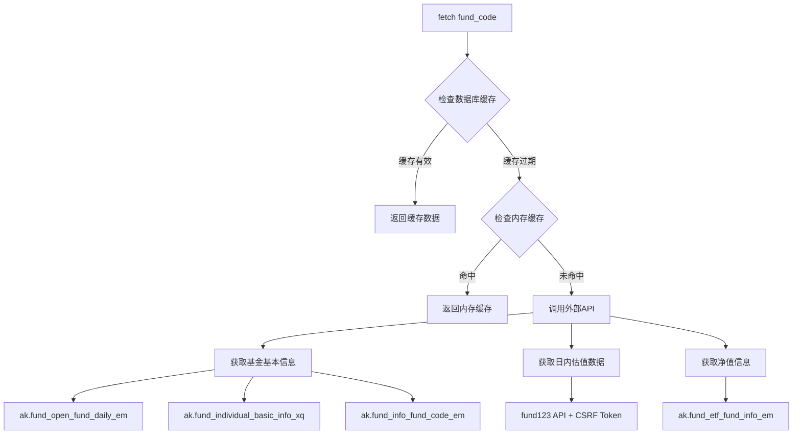
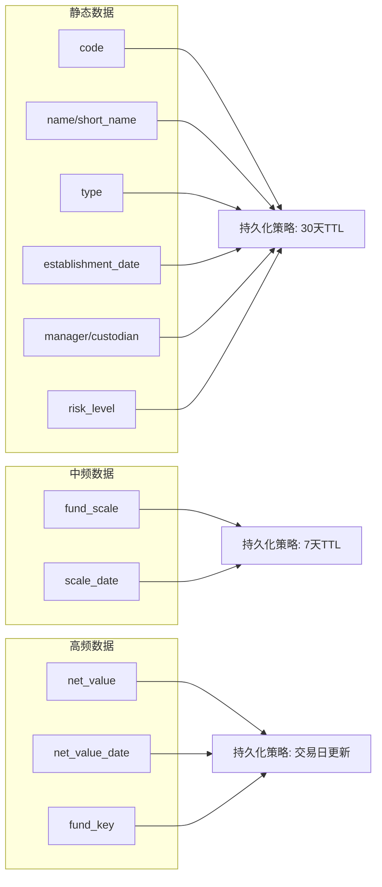
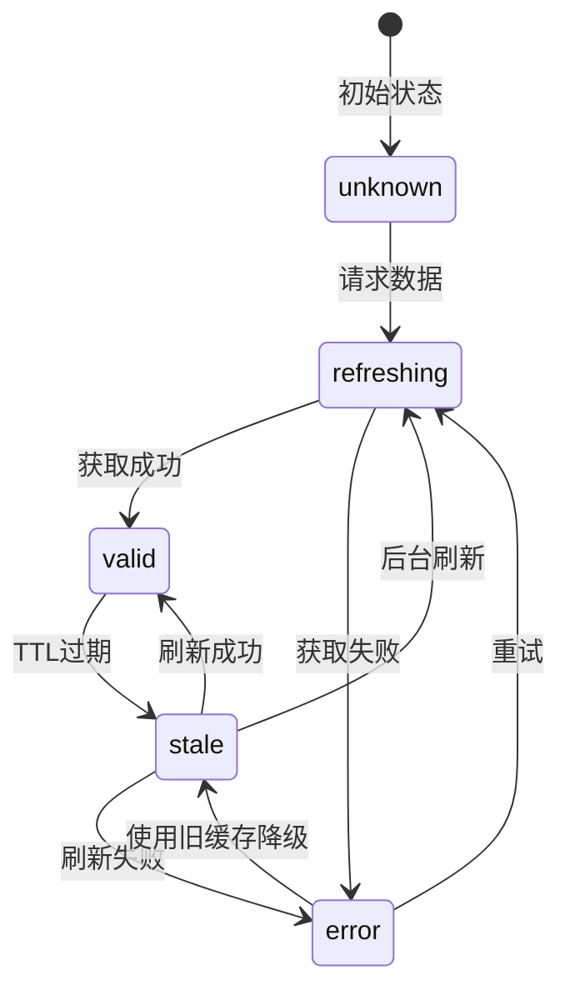
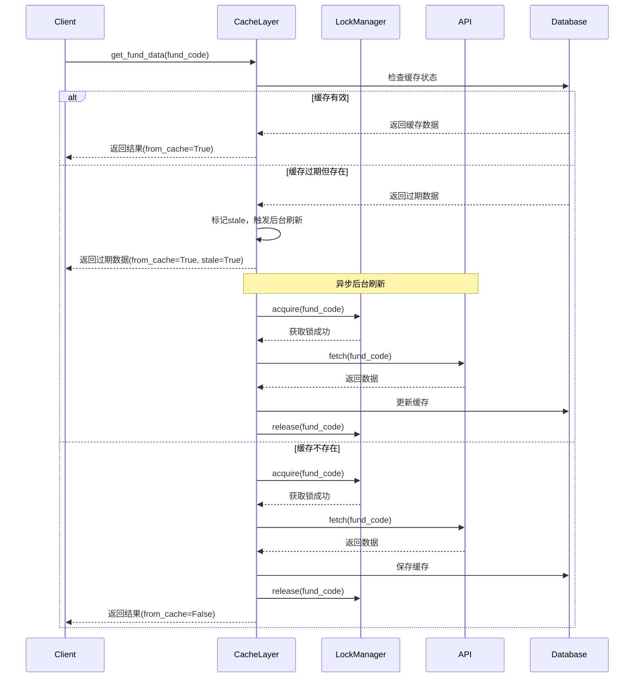

# 基金数据持久化与缓存策略设计文档

## 1. 现有代码分析报告

### 1.1 数据源架构概述

当前基金数据获取主要在 [`fund_source.py`](src/datasources/fund_source.py) 中实现，包含以下核心数据源：

| 数据源类 | 用途 | 主要API |
|---------|------|---------|
| `Fund123DataSource` | 主数据源，fund123.cn | CSRF token + REST API |
| `FundDataSource` | 天天基金备用源 | fundgz.1234567.com.cn |
| `SinaFundDataSource` | 新浪基金备用源 | finance.sina.com.cn |
| `EastMoneyFundDataSource` | 东方财富备用源 | fund.eastmoney.com |

### 1.2 API调用模式分析

通过代码分析，识别出以下API调用热点：



#### 1.2.1 高频重复调用识别

| 调用场景 | API | 触发频率 | 问题 |
|---------|-----|---------|------|
| 获取基金简称 | `ak.fund_open_fund_daily_em()` | 每次获取基本信息 | 返回全量基金列表，约8000+条 |
| 获取基金类型 | `ak.fund_individual_basic_info_xq()` | 每次基本信息缺失时 | 单条查询，响应慢 |
| 获取基金规模 | `ak.fund_info_fund_code_em()` | 每次完整信息获取 | 单条查询 |
| 获取净值日期 | `ak.fund_etf_fund_info_em()` | 净值缓存过期时 | 获取一年历史数据 |
| 获取日内估值 | fund123 API | 每次实时数据请求 | 需要先获取CSRF token |

#### 1.2.2 重复调用根因分析

1. **内存缓存容量限制**: `_fund_info_cache` 仅保存基本信息，且 TTL=1小时后失效
2. **数据库字段缺失触发**: 若 `type` 字段为空，会重新调用 akshare API
3. **缓存一致性缺失**: 无数据版本或校验机制，无法判断是否需要刷新
4. **缓存预热缺失**: 应用启动时无预热机制

### 1.3 现有缓存机制评估

#### 1.3.1 三层缓存架构

```
请求 → 数据库缓存 → 内存缓存 → 文件缓存 → API回源
```

#### 1.3.2 现有缓存DAO评估

| DAO类 | 表名 | TTL设置 | 评估 |
|-------|------|--------|------|
| `FundBasicInfoDAO` | fund_basic_info | 无明确TTL | ⚠️ 缺少过期策略 |
| `FundDailyCacheDAO` | fund_daily_cache | 300秒(5分钟) | ✅ 已实现 |
| `FundIntradayCacheDAO` | fund_intraday_cache | 60秒 | ✅ 已实现 |

#### 1.3.3 存在的问题

1. **缓存穿透风险**: 
   - `get_fund_basic_info()` 中，如果 `type` 为空，会跳过缓存直接调用API
   - 这可能导致同一基金被重复查询

2. **缓存击穿风险**:
   - 无分布式锁或互斥锁机制
   - 并发请求可能同时穿透到API

3. **缓存雪崩风险**:
   - 大量缓存同时过期时可能引发API压力

4. **数据一致性**:
   - `net_value` 和 `net_value_date` 的更新策略不明确
   - QDII基金净值延迟更新的处理不够优雅

---

## 2. 数据持久化字段分析

### 2.1 基金基本信息字段分类

根据更新频率，将字段分为三类：

#### 2.1.1 静态/低频变动字段（长期持久化）

| 字段 | 说明 | 更新频率 | TTL建议 |
|------|------|---------|---------|
| `code` | 基金代码 | 永不 | 永久 |
| `name` / `full_name` | 基金名称 | 极少变更 | 30天 |
| `short_name` | 基金简称 | 极少变更 | 30天 |
| `type` | 基金类型 | 极少变更 | 30天 |
| `establishment_date` | 成立日期 | 永不 | 永久 |
| `manager` | 基金管理人 | 低频 | 30天 |
| `custodian` | 基金托管人 | 低频 | 30天 |
| `risk_level` | 风险等级 | 极少变更 | 30天 |

#### 2.1.2 中频变动字段（周级更新）

| 字段 | 说明 | 更新频率 | TTL建议 |
|------|------|---------|---------|
| `fund_scale` | 基金规模 | 季度/月度 | 7天 |
| `scale_date` | 规模日期 | 随规模更新 | 7天 |

#### 2.1.3 高频变动字段（日级更新）

| 字段 | 说明 | 更新频率 | TTL建议 |
|------|------|---------|---------|
| `net_value` | 单位净值 | 每交易日 | 1天 |
| `net_value_date` | 净值日期 | 每交易日 | 1天 |
| `fund_key` | fund123关键字 | 可能变化 | 1天 |

### 2.2 推荐的数据持久化策略



---

## 3. 数据库表结构设计

### 3.1 现有表结构优化建议

#### 3.1.1 `fund_basic_info` 表增强

```sql
-- 添加缓存元数据字段
ALTER TABLE fund_basic_info ADD COLUMN data_version INTEGER DEFAULT 0;
ALTER TABLE fund_basic_info ADD COLUMN cache_status TEXT DEFAULT 'valid';
-- valid, stale, refreshing, error
ALTER TABLE fund_basic_info ADD COLUMN last_refresh_at TEXT;
ALTER TABLE fund_basic_info ADD COLUMN refresh_error TEXT;
ALTER TABLE fund_basic_info ADD COLUMN api_source TEXT;
-- akshare, fund123, tushare
```

#### 3.1.2 新增缓存元数据表

```sql
CREATE TABLE IF NOT EXISTS fund_cache_metadata (
    fund_code TEXT PRIMARY KEY,
    -- 基本信息缓存
    basic_info_status TEXT DEFAULT 'unknown',
    -- unknown, valid, stale, refreshing, error
    basic_info_fetched_at TEXT,
    basic_info_expires_at TEXT,
    basic_info_source TEXT,
    basic_info_error TEXT,
    
    -- 净值缓存
    net_value_status TEXT DEFAULT 'unknown',
    net_value_fetched_at TEXT,
    net_value_expires_at TEXT,
    net_value_source TEXT,
    net_value_error TEXT,
    
    -- 日内数据缓存
    intraday_status TEXT DEFAULT 'unknown',
    intraday_fetched_at TEXT,
    intraday_expires_at TEXT,
    
    -- 更新时间
    updated_at TEXT DEFAULT datetime('now'),
    
    FOREIGN KEY (fund_code) REFERENCES fund_basic_info(code) ON DELETE CASCADE
);

CREATE INDEX IF NOT EXISTS idx_cache_metadata_status ON fund_cache_metadata(basic_info_status);
CREATE INDEX IF NOT EXISTS idx_cache_metadata_expires ON fund_cache_metadata(basic_info_expires_at);
```

#### 3.1.3 新增API调用统计表

```sql
CREATE TABLE IF NOT EXISTS api_call_stats (
    id INTEGER PRIMARY KEY AUTOINCREMENT,
    api_name TEXT NOT NULL,
    -- 如: ak.fund_open_fund_daily_em, fund123.searchFund
    fund_code TEXT,
    call_time TEXT NOT NULL,
    response_time_ms INTEGER,
    success INTEGER DEFAULT 1,
    error_message TEXT,
    cache_hit INTEGER DEFAULT 0,
    -- 是否命中缓存
    created_at TEXT DEFAULT datetime('now')
);

CREATE INDEX IF NOT EXISTS idx_api_stats_name ON api_call_stats(api_name);
CREATE INDEX IF NOT EXISTS idx_api_stats_fund ON api_call_stats(fund_code);
CREATE INDEX IF NOT EXISTS idx_api_stats_time ON api_call_stats(call_time);
```

### 3.2 完整DDL语句

```sql
-- ============================================
-- 基金数据持久化与缓存优化 - DDL
-- ============================================

-- 1. 增强 fund_basic_info 表
ALTER TABLE fund_basic_info ADD COLUMN data_version INTEGER DEFAULT 0;
ALTER TABLE fund_basic_info ADD COLUMN cache_status TEXT DEFAULT 'valid';
ALTER TABLE fund_basic_info ADD COLUMN last_refresh_at TEXT;
ALTER TABLE fund_basic_info ADD COLUMN refresh_error TEXT;
ALTER TABLE fund_basic_info ADD COLUMN api_source TEXT;

-- 2. 新建缓存元数据表
CREATE TABLE IF NOT EXISTS fund_cache_metadata (
    fund_code TEXT PRIMARY KEY,
    basic_info_status TEXT DEFAULT 'unknown',
    basic_info_fetched_at TEXT,
    basic_info_expires_at TEXT,
    basic_info_source TEXT,
    basic_info_error TEXT,
    net_value_status TEXT DEFAULT 'unknown',
    net_value_fetched_at TEXT,
    net_value_expires_at TEXT,
    net_value_source TEXT,
    net_value_error TEXT,
    intraday_status TEXT DEFAULT 'unknown',
    intraday_fetched_at TEXT,
    intraday_expires_at TEXT,
    updated_at TEXT DEFAULT datetime('now'),
    FOREIGN KEY (fund_code) REFERENCES fund_basic_info(code) ON DELETE CASCADE
);

-- 3. 新建API调用统计表
CREATE TABLE IF NOT EXISTS api_call_stats (
    id INTEGER PRIMARY KEY AUTOINCREMENT,
    api_name TEXT NOT NULL,
    fund_code TEXT,
    call_time TEXT NOT NULL,
    response_time_ms INTEGER,
    success INTEGER DEFAULT 1,
    error_message TEXT,
    cache_hit INTEGER DEFAULT 0,
    created_at TEXT DEFAULT datetime('now')
);

-- 4. 创建索引
CREATE INDEX IF NOT EXISTS idx_cache_metadata_status ON fund_cache_metadata(basic_info_status);
CREATE INDEX IF NOT EXISTS idx_cache_metadata_expires ON fund_cache_metadata(basic_info_expires_at);
CREATE INDEX IF NOT EXISTS idx_api_stats_name ON api_call_stats(api_name);
CREATE INDEX IF NOT EXISTS idx_api_stats_fund ON api_call_stats(fund_code);
CREATE INDEX IF NOT EXISTS idx_api_stats_time ON api_call_stats(call_time);
CREATE INDEX IF NOT EXISTS idx_api_stats_created ON api_call_stats(created_at);

-- 5. 触发器：自动更新 updated_at
CREATE TRIGGER IF NOT EXISTS update_cache_metadata_timestamp 
AFTER UPDATE ON fund_cache_metadata
BEGIN
    UPDATE fund_cache_metadata SET updated_at = datetime('now') WHERE fund_code = NEW.fund_code;
END;
```

---

## 4. 缓存更新策略设计

### 4.1 TTL策略定义

```python
# 缓存TTL配置（秒）
CACHE_TTL_CONFIG = {
    # 基本信息缓存
    "basic_info": {
        "static_fields": 30 * 24 * 3600,  # 30天：name, type, manager等
        "mid_fields": 7 * 24 * 3600,       # 7天：fund_scale
        "dynamic_fields": 24 * 3600,       # 1天：net_value, net_value_date
    },
    
    # 净值缓存
    "net_value": {
        "default": 24 * 3600,              # 1天
        "trading_day": 300,                # 交易日5分钟（开盘期间）
        "non_trading_day": 24 * 3600,      # 非交易日1天
    },
    
    # 日内分时缓存
    "intraday": {
        "trading_hours": 60,               # 交易时段60秒
        "non_trading_hours": 3600,         # 非交易时段1小时
    },
    
    # 每日缓存
    "daily_cache": {
        "default": 300,                    # 5分钟
    },
}
```

### 4.2 缓存状态机设计



### 4.3 "数据库优先，API回源"获取策略

#### 4.3.1 伪代码实现

```python
async def get_fund_data_with_cache(fund_code: str) -> DataSourceResult:
    """
    基金数据获取策略：
    1. 数据库优先
    2. 缓存过期时异步刷新
    3. API回源时使用锁防止击穿
    """
    
    # Step 1: 检查数据库缓存
    cache_meta = get_cache_metadata(fund_code)
    
    if cache_meta and cache_meta.basic_info_status == 'valid':
        if not is_cache_expired(cache_meta.basic_info_expires_at):
            # 缓存有效，直接返回
            return build_result_from_cache(fund_code)
        
        # 缓存过期但数据存在，标记为stale，后台刷新
        mark_cache_stale(fund_code)
        trigger_background_refresh(fund_code)
        return build_result_from_cache(fund_code)
    
    # Step 2: 缓存不存在或状态为error，需要同步获取
    # 使用分布式锁防止缓存击穿
    async with cache_lock(fund_code, timeout=30):
        # 双重检查：可能其他请求已经刷新了缓存
        cache_meta = get_cache_metadata(fund_code)
        if cache_meta and cache_meta.basic_info_status == 'valid':
            return build_result_from_cache(fund_code)
        
        # Step 3: API回源
        mark_cache_refreshing(fund_code)
        try:
            result = await fetch_from_api(fund_code)
            if result.success:
                save_to_database(fund_code, result.data)
                mark_cache_valid(fund_code)
            else:
                mark_cache_error(fund_code, result.error)
            return result
        except Exception as e:
            mark_cache_error(fund_code, str(e))
            raise
```

### 4.4 并发更新与缓存击穿保护

#### 4.4.1 锁机制设计

```python
import asyncio
from contextlib import asynccontextmanager
from typing import Optional

class CacheLockManager:
    """缓存锁管理器，防止缓存击穿"""
    
    _locks: dict[str, asyncio.Lock] = {}
    _lock = asyncio.Lock()  # 保护 _locks 字典的锁
    
    @classmethod
    @asynccontextmanager
    async def acquire(cls, key: str, timeout: float = 30.0):
        """
        获取缓存锁
        
        Args:
            key: 缓存键（如基金代码）
            timeout: 锁超时时间
        """
        # 获取或创建锁
        async with cls._lock:
            if key not in cls._locks:
                cls._locks[key] = asyncio.Lock()
            lock = cls._locks[key]
        
        # 尝试获取锁
        acquired = False
        try:
            acquired = await asyncio.wait_for(lock.acquire(), timeout=timeout)
            if not acquired:
                raise CacheLockTimeoutError(f"获取缓存锁超时: {key}")
            yield
        finally:
            if acquired:
                lock.release()
                # 清理不再使用的锁
                async with cls._lock:
                    if not lock.locked() and key in cls._locks:
                        del cls._locks[key]


class CacheLockTimeoutError(Exception):
    """缓存锁超时异常"""
    pass
```

#### 4.4.2 降级策略

```python
async def get_with_fallback(fund_code: str) -> DataSourceResult:
    """
    带降级的获取策略：
    1. 缓存有效 → 返回缓存
    2. 缓存过期 → 后台刷新 + 返回旧缓存
    3. 缓存不存在 → API获取
    4. API失败 → 返回错误或默认值
    """
    cache_meta = get_cache_metadata(fund_code)
    
    # Case 1: 缓存有效
    if cache_meta and cache_meta.status == 'valid' and not is_expired(cache_meta):
        return build_result(fund_code, from_cache=True)
    
    # Case 2: 缓存过期但有数据（降级）
    if cache_meta and cache_meta.status in ('stale', 'error'):
        # 触发后台刷新
        asyncio.create_task(background_refresh(fund_code))
        # 返回旧数据
        logger.warning(f"使用过期缓存: {fund_code}, 过期时间: {cache_meta.expires_at}")
        return build_result(fund_code, from_cache=True, stale=True)
    
    # Case 3: 无缓存，需要API获取
    try:
        async with CacheLockManager.acquire(fund_code):
            result = await fetch_from_api(fund_code)
            if result.success:
                save_cache(fund_code, result.data)
            return result
    except CacheLockTimeoutError:
        # 锁超时，可能是其他请求正在刷新
        # 等待一小段时间后重试读取缓存
        await asyncio.sleep(0.5)
        cache_meta = get_cache_metadata(fund_code)
        if cache_meta:
            return build_result(fund_code, from_cache=True)
        return DataSourceResult(success=False, error="缓存刷新超时")
```

### 4.5 缓存刷新流程



---

## 5. 实现建议

### 5.1 新增模块结构

```
src/db/
├── cache/
│   ├── __init__.py
│   ├── metadata_dao.py      # 缓存元数据DAO
│   ├── lock_manager.py      # 缓存锁管理器
│   └── refresh_scheduler.py # 后台刷新调度器
├── stats/
│   ├── __init__.py
│   └── api_stats_dao.py     # API调用统计DAO
└── fund/
    ├── basic_info_dao.py    # 已存在，需增强
    ├── daily_cache_dao.py   # 已存在
    └── intraday_cache_dao.py # 已存在
```

### 5.2 配置化管理

```python
# src/config/cache_config.py

from dataclasses import dataclass
from typing import Optional

@dataclass
class CacheConfig:
    """缓存配置"""
    
    # 基本信息TTL（秒）
    basic_info_static_ttl: int = 30 * 24 * 3600  # 30天
    basic_info_mid_ttl: int = 7 * 24 * 3600      # 7天
    basic_info_dynamic_ttl: int = 24 * 3600      # 1天
    
    # 净值TTL
    net_value_ttl: int = 24 * 3600               # 1天
    net_value_trading_ttl: int = 300             # 交易日5分钟
    
    # 日内缓存TTL
    intraday_ttl: int = 60                       # 60秒
    
    # 每日缓存TTL
    daily_cache_ttl: int = 300                   # 5分钟
    
    # 锁配置
    lock_timeout: int = 30                       # 锁超时时间
    
    # 后台刷新配置
    refresh_batch_size: int = 10                 # 批量刷新大小
    refresh_interval: int = 60                   # 刷新间隔
    
    # 降级配置
    stale_cache_max_age: int = 7 * 24 * 3600    # 过期缓存最大可用时间
```

### 5.3 迁移步骤

1. **Phase 1: 数据库迁移**
   - 添加新字段到 `fund_basic_info` 表
   - 创建 `fund_cache_metadata` 表
   - 创建 `api_call_stats` 表

2. **Phase 2: DAO增强**
   - 实现 `CacheMetadataDAO`
   - 实现 `ApiCallStatsDAO`
   - 增强 `FundBasicInfoDAO`

3. **Phase 3: 缓存层实现**
   - 实现 `CacheLockManager`
   - 实现缓存刷新调度器
   - 集成到现有数据获取流程

4. **Phase 4: 监控与优化**
   - 添加缓存命中率监控
   - 添加API调用统计
   - 优化TTL配置

### 5.4 监控指标

```python
# 建议添加的监控指标

METRICS = {
    # 缓存指标
    "cache_hit_rate": "缓存命中率",
    "cache_miss_count": "缓存未命中次数",
    "cache_stale_count": "使用过期缓存次数",
    
    # API指标
    "api_call_count": "API调用次数",
    "api_avg_response_time": "API平均响应时间",
    "api_error_rate": "API错误率",
    
    # 锁指标
    "lock_wait_time": "锁等待时间",
    "lock_timeout_count": "锁超时次数",
}
```

---

## 6. 总结

### 6.1 关键优化点

1. **数据分层持久化**: 按更新频率将字段分类，设置不同TTL
2. **缓存状态机**: 明确定义缓存生命周期状态
3. **锁机制防护**: 防止并发请求导致的缓存击穿
4. **降级策略**: 过期缓存可用，提升系统可用性
5. **监控统计**: API调用统计和缓存命中率监控

### 6.2 预期收益

- **减少API调用**: 预计减少60-80%的重复akshare API调用
- **提升响应速度**: 缓存命中时响应时间从秒级降至毫秒级
- **系统稳定性**: 降级策略保证API不可用时的基本服务
- **可观测性**: 监控指标便于问题定位和性能优化

### 6.3 风险与注意事项

1. **数据一致性**: 需要处理缓存与实际数据不一致的情况
2. **存储空间**: 需要定期清理过期的统计数据
3. **锁竞争**: 高并发场景下锁可能成为瓶颈
4. **后台刷新**: 需要合理控制刷新频率，避免对API造成压力