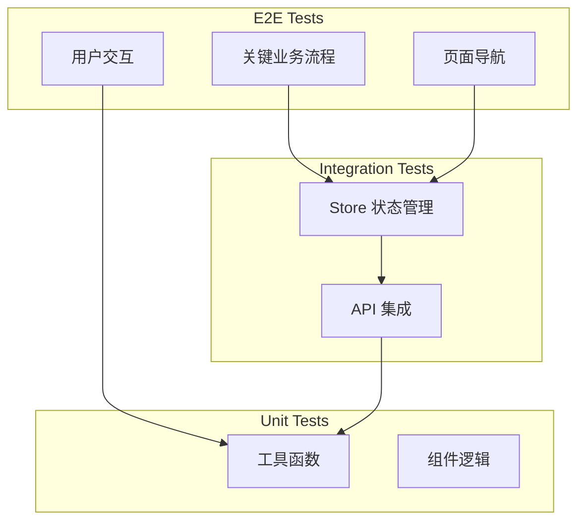

# Playwright E2E 测试策略

## 项目现状分析

### 当前测试情况
- **后端测试**: 使用 pytest，约 40 个测试文件，覆盖 API 路由、数据源、缓存、数据库等
- **前端测试**: 无 - 未配置任何前端测试框架
- **Playwright 依赖**: 已安装 `playwright@^1.58.2`，但未配置

### 前端页面结构
| 路由 | 页面组件 | 核心功能 |
|------|----------|----------|
| `/` | HomeView | 首页仪表盘、快速访问入口 |
| `/funds` | FundsView | 基金自选列表、添加/删除基金 |
| `/commodities` | CommoditiesView | 商品行情、分类切换 |
| `/indices` | IndicesView | 全球市场指数 |
| `/sectors` | SectorsView | 行业板块、资金流向 |
| `/calendar` | EconomicCalendarView | 经济日历 |
| `/bonds` | BondsView | 债券行情 |
| `/stocks` | StocksView | 股票信息 |
| `/settings` | SettingsView | 系统设置 |

---

## 测试策略

### 测试类型分层



### E2E 测试优先级

#### P0 - 核心流程（必须覆盖）
1. **页面加载验证** - 确保所有页面能正常渲染
2. **导航功能** - 侧边栏导航各页面跳转
3. **基金自选功能** - 添加/删除/查看基金

#### P1 - 重要功能
4. **商品行情浏览** - 分类切换、商品详情
5. **全球指数查看** - 指数卡片展示
6. **行业板块分析** - 板块列表、资金流向

#### P2 - 辅助功能
7. **响应式布局** - 移动端适配测试
8. **错误状态** - 网络错误、空数据状态
9. **WebSocket 实时更新** - 数据推送

---

## 测试架构设计

### 目录结构
```
web/
├── e2e/
│   ├── playwright.config.ts      # Playwright 配置
│   ├── fixtures/                  # 测试固件
│   │   ├── index.ts              # 自定义 fixtures
│   │   └── mock-data.ts          # Mock 数据
│   ├── page-objects/              # 页面对象模型
│   │   ├── BasePage.ts            # 基础页面类
│   │   ├── HomePage.ts            # 首页 PO
│   │   ├── FundsPage.ts           # 基金页面 PO
│   │   ├── CommoditiesPage.ts     # 商品页面 PO
│   │   └── ...
│   ├── tests/                     # 测试文件
│   │   ├── home.spec.ts           # 首页测试
│   │   ├── navigation.spec.ts     # 导航测试
│   │   ├── funds.spec.ts          # 基金功能测试
│   │   ├── commodities.spec.ts     # 商品功能测试
│   │   ├── indices.spec.ts         # 指数页面测试
│   │   ├── sectors.spec.ts         # 板块页面测试
│   │   └── responsive.spec.ts      # 响应式测试
│   └── utils/                     # 测试工具
│       ├── api-mock.ts            # API Mock 工具
│       └── helpers.ts             # 通用辅助函数
```

### 页面对象模型示例

```typescript
// e2e/page-objects/BasePage.ts
import { Page, Locator } from '@playwright/test';

export abstract class BasePage {
  readonly page: Page;
  
  constructor(page: Page) {
    this.page = page;
  }
  
  async navigate(path: string) {
    await this.page.goto(path);
  }
  
  async waitForLoad() {
    await this.page.waitForLoadState('networkidle');
  }
}
```

```typescript
// e2e/page-objects/HomePage.ts
import { Locator } from '@playwright/test';
import { BasePage } from './BasePage';

export class HomePage extends BasePage {
  readonly heroTitle: Locator;
  readonly quickActions: Locator;
  readonly fundCount: Locator;
  
  constructor(page: Page) {
    super(page);
    this.heroTitle = page.locator('.hero-title');
    this.quickActions = page.locator('.action-card');
    this.fundCount = page.locator('.stat-value').first();
  }
  
  async goto() {
    await this.navigate('/');
    await this.waitForLoad();
  }
  
  async clickAction(action: string) {
    await this.quickActions.filter({ hasText: action }).click();
  }
}
```

---

## API Mock 策略

### Mock 数据源
由于测试环境可能无法访问真实数据源，建议采用以下策略：

1. **完全 Mock 模式** - 用于 CI/CD
   - 拦截所有 API 请求
   - 返回预定义的 Mock 数据
   - 快速、稳定、无外部依赖

2. **真实 API 模式** - 用于本地开发调试
   - 连接真实后端服务
   - 验证实际数据流

### Mock 示例

```typescript
// e2e/utils/api-mock.ts
import { Page } from '@playwright/test';

export async function mockFundsApi(page: Page) {
  await page.route('**/api/funds*', async route => {
    await route.fulfill({
      status: 200,
      contentType: 'application/json',
      body: JSON.stringify({
        funds: [
          { code: '000001', name: '华夏成长', estimateChangePercent: 1.23 },
          { code: '000002', name: '华夏红利', estimateChangePercent: -0.56 },
        ]
      })
    });
  });
}
```

---

## CI/CD 集成

### GitHub Actions 配置

```yaml
# .github/workflows/e2e-tests.yml
name: E2E Tests

on:
  push:
    branches: [main, develop]
  pull_request:
    branches: [main]

jobs:
  e2e:
    runs-on: ubuntu-latest
    steps:
      - uses: actions/checkout@v4
      
      - name: Setup Node.js
        uses: actions/setup-node@v4
        with:
          node-version: '20'
          cache: 'pnpm'
      
      - name: Install dependencies
        run: pnpm install
        
      - name: Install Playwright browsers
        run: pnpm exec playwright install --with-deps
        
      - name: Run E2E tests
        run: pnpm run test:e2e
        
      - uses: actions/upload-artifact@v4
        if: always()
        with:
          name: playwright-report
          path: web/e2e/playwright-report/
          retention-days: 7
```

---

## 测试用例清单

### 首页测试 (`home.spec.ts`)
- [ ] 页面正常加载，显示标题和统计
- [ ] 快速访问卡片点击跳转正确
- [ ] 涨跌幅排行显示（有数据时）
- [ ] 空状态提示（无基金时）
- [ ] 加载状态骨架屏

### 导航测试 (`navigation.spec.ts`)
- [ ] 侧边栏导航到各页面
- [ ] URL 变化正确
- [ ] 页面标题更新
- [ ] 移动端菜单展开/收起

### 基金功能测试 (`funds.spec.ts`)
- [ ] 基金列表展示
- [ ] 添加基金弹窗打开/关闭
- [ ] 搜索基金功能
- [ ] 确认添加基金
- [ ] 删除基金确认
- [ ] 基金卡片数据展示
- [ ] 估值更新（Mock WebSocket）

### 商品功能测试 (`commodities.spec.ts`)
- [ ] 商品分类切换
- [ ] 商品列表展示
- [ ] 商品搜索
- [ ] 添加/移除自选

### 响应式测试 (`responsive.spec.ts`)
- [ ] 桌面端布局（1440px）
- [ ] 平板布局（768px）
- [ ] 手机布局（375px）
- [ ] 侧边栏响应式折叠

---

## 实施计划

### 第一阶段：基础配置
1. 创建 `playwright.config.ts` 配置文件
2. 配置测试脚本到 `package.json`
3. 设置 CI/CD 工作流
4. 创建基础 fixtures 和工具函数

### 第二阶段：核心测试
5. 实现首页测试
6. 实现导航测试
7. 实现基金功能测试

### 第三阶段：扩展测试
8. 实现商品页面测试
9. 实现指数/板块页面测试
10. 实现响应式布局测试

### 第四阶段：完善优化
11. 添加 API Mock 层
12. 添加测试覆盖率报告
13. 优化测试性能
14. 文档完善

---

## 配置文件示例

### playwright.config.ts

```typescript
import { defineConfig, devices } from '@playwright/test';

export default defineConfig({
  testDir: './tests',
  fullyParallel: true,
  forbidOnly: !!process.env.CI,
  retries: process.env.CI ? 2 : 0,
  workers: process.env.CI ? 1 : undefined,
  reporter: 'html',
  
  use: {
    baseURL: 'http://localhost:3000',
    trace: 'on-first-retry',
    screenshot: 'only-on-failure',
  },

  projects: [
    {
      name: 'chromium',
      use: { ...devices['Desktop Chrome'] },
    },
    {
      name: 'Mobile Chrome',
      use: { ...devices['Pixel 5'] },
    },
  ],

  webServer: {
    command: 'pnpm run dev:web',
    url: 'http://localhost:3000',
    reuseExistingServer: !process.env.CI,
  },
});
```

### package.json 新增脚本

```json
{
  "scripts": {
    "test:e2e": "playwright test",
    "test:e2e:ui": "playwright test --ui",
    "test:e2e:debug": "playwright test --debug",
    "test:e2e:report": "playwright show-report"
  }
}